# Ensemble Genetic Algorithm

[](https://github.com/SamoraHunter/ensemble_genetic_algorithm/actions/workflows/notebook-test.yml)
[](https://ensemble-genetic-algorithm.readthedocs.io/en/latest/?badge=latest)
[](https://badge.fury.io/py/ensemble-genetic-algorithm)
[](https://opensource.org/licenses/MIT)

# Table of Contents

- [Ensemble Genetic Algorithm](#ensemble-genetic-algorithm)
  - [Description](#description)
  - [Installation](#installation)
  - [Project Dataset requirements](#project-dataset-requirements)
  - [Environment Information](#environment-information)
  - [Usage](#usage)
    - [Example Configuration](#example-configuration)
  - [📘 FAQ / User Guide](#-faq--user-guide)
  - [Diagrams](#diagrams)
  - [License](#license)


**Description**: Genetic algorithm to evolve a machine learning ensemble for binary classification.

Prerequisites:
Develop a data matrix d for a binary classification problem. See [pat2vec](https://github.com/SamoraHunter/pat2vec).

Applies a grid search over featurespace and genetic algorithm hyperparameters to optimise for an ensemble of machine learning classifiers on a binary classification problem. 

-Extensible,  
  -select base learners for inclusion
-Highly configurable
  -Configure base learners 
-Flexible
  -Framework can be extended for regression or multiclass classification

**See appendix for in depth description**

## Installation

This project can be installed using the provided setup script or manually.

### Prerequisites

-   **Python**: Version 3.10 or higher.
-   **Git**: For cloning the repository.
-   **(Optional) NVIDIA GPU with CUDA**: For GPU-accelerated computations.

### Manual Installation

If you prefer to set up the environment manually, you can follow these steps. This project uses `pyproject.toml` to manage dependencies.

1.  **Clone the repository:**
    ```bash
    git clone https://github.com/SamoraHunter/ensemble_genetic_algorithm.git
    cd ensemble_genetic_algorithm
    ```

2.  **Create and activate a virtual environment:**
    It is highly recommended to use a virtual environment.
    ```bash
    python3 -m venv .venv
    source .venv/bin/activate  # On Windows, use `.venv\Scripts\activate`
    ```

3.  **Install dependencies:**
    Install the project and its dependencies using pip. The dependencies are defined in `pyproject.toml`.
    ```bash
    pip install .
    ```
    To install with optional dependencies for development (like testing tools), use:
    ```bash
    pip install .[dev]
    ```

### Using the Setup Script (Alternative)

This project also includes a comprehensive setup script to automate the creation of a dedicated Python virtual environment and install all necessary dependencies.

1.  **Clone the repository:**
    ```bash
    git clone https://github.com/SamoraHunter/ensemble_genetic_algorithm.git
    cd ensemble_genetic_algorithm
    ```

2.  **Run the setup script:**
    Make the script executable and then run it.
    ```bash
    chmod +x setup.sh
    ./setup.sh
    ```
    This will create a virtual environment named `ga_env`, install the default dependencies from `pyproject.toml`, and set up a Jupyter kernel. The environment will be activated for your current terminal session.

### Installation Options

The setup script supports different installation profiles. You can specify one using flags:

-   `./setup.sh --cpu`: Installs the CPU-only version of PyTorch. Ideal for systems without a dedicated GPU.
-   `./setup.sh --gpu`: Installs dependencies with GPU support (requires a compatible NVIDIA GPU and CUDA toolkit).
-   `./setup.sh --dev`: Installs all development dependencies, including tools for testing.
-   `./setup.sh --all`: Installs everything, including GPU and development dependencies.

To see all available options, run:
```bash
./setup.sh --help
```

### Activating the Environment

The setup script activates the `ga_env` environment for your current session. For future sessions, you can activate it manually:

```bash
source ga_env/bin/activate
```

## Project Dataset requirements

A numeric data matrix (Pandas dataframe) with a binary outcome variable with the suffix label _outcome_var_1. For more details see https://github.com/SamoraHunter/pat2vec/tree/main.

## Environment Information

- **Python**: >=3.10
- **Operating System**: Linux-5.4.0-125-generic-x86_64-with-debian-buster-sid

## Usage

To use this project, follow the steps below:

1. **Set Paths for Input Data**: Ensure you have the necessary input data and set the paths accordingly. Refer to the unit test synthetic data for an example of the feature column naming convention.

2. **Configure Feature Space Exploration**:
   - Determine which parameters to include in the feature space exploration by setting the `grid` parameter to `True` or `False`.

3. **Configure Learning Algorithm Inclusion**:
   - Customize the list of learning algorithms you want to include by populating the `modelFuncList` variable.

4. **Configure Genetic Algorithm Hyperparameters**:
   - Adjust the genetic algorithm's hyperparameters as needed:
     - Maximum Individual Size: Set the value for `nb_params`.
     - Population Size: Set the value for `pop_params`.
     - Maximum Generation Number: Set the value for `g_params`.

Example Configuration:

```python
# Example Configuration
grid = {
    # Set feature space exploration parameters
    "parameter1": True,
    "parameter2": False,
    # Add more parameters as needed
}

modelFuncList = [
    # Add learning algorithms to include in the experiment
    "Algorithm1",
    "Algorithm2",
    # Add more algorithms as needed
]

# Genetic algorithm hyperparameters
nb_params = 100  # Maximum individual size
pop_params = 50  # Population size
g_params = 10    # Maximum generation number

```

## 📘 FAQ / User Guide

For answers to common questions and more detailed user guidance, please see the [Project Wiki](https://github.com/SamoraHunter/ensemble_genetic_algorithm/wiki), which includes a comprehensive [FAQ / User Guide](https://github.com/SamoraHunter/ensemble_genetic_algorithm/wiki/FAQ).
For a detailed walkthrough of the main example, see the [Example Usage Notebook Guide](docs_wiki/Example_Usage_Notebook.md). To understand the plots and results from an experiment, see the [Interpreting Results Guide](docs_wiki/Interpreting_Results.md). To extend the framework with your own models, see the guide on [Adding a New Base Learner](docs_wiki/Adding_a_New_Base_Learner.md). To validate your final models on unseen data, see the guide on [Evaluating Final Models](docs_wiki/Evaluating_Final_Models.md). To prepare your data correctly, refer to the [Data Preparation Guide](docs_wiki/Data_Preparation_Guide.md).

For a deeper understanding of the project's structure, please review the following guides:
- [Architectural Overview](docs_wiki/Architectural_Overview.md): A high-level look at how the components work together.
- [Configuration Guide](docs_wiki/Configuration_Guide.md): A detailed reference for all configuration parameters.
- [Genetic Algorithm Deep Dive](docs_wiki/Genetic_Algorithm_Deep_Dive.md): A code-oriented explanation of the evolutionary process.
- [Hyperparameter Reference](docs_wiki/Hyperparameter_Reference.md): A detailed dictionary of all tunable hyperparameters.
- [Best Practices and Tips](docs_wiki/Best_Practices.md): A guide to running experiments effectively and efficiently.
- [Troubleshooting Guide](docs_wiki/Troubleshooting.md): Solutions to common errors and issues.


# Diagrams

This section contains visual representations of the genetic algorithm implementation and model architecture.

## Data pipeline and genetic algorithm

### GA Example usage, data grid and GA grid permutations, system flow (example_usage.ipynb)

- **Source**: [assets/example_usage_permutations.mmd](assets/example_usage_permutations.mmd)
- **Description**: Illustrates the genetic algorithm search over grid parameters. (See example usage).

### GA Data Flow

- **Source**: [assets/ga_data_diagram.mmd](assets/ga_data_diagram.mmd)
- **Description**: Illustrates the data flow through the genetic algorithm pipeline

### Model Class Structure

- **Source**: [assets/model_classes.mmd](assets/model_classes.mmd)
- **Description**: Shows the inheritance hierarchy and relationships between model classes

## Genetic Algorithm Components

### Weighting System

- **Source**: [assets/ga_weighting.mmd](assets/ga_weighting.mmd)
- **Description**: Demonstrates the weighting mechanism used in the genetic algorithm

### Parameter Space Grid

- **Source**: [assets/grid_param_space_ga.mmd](assets/grid_param_space_ga.mmd)
- **Description**: Visualizes the parameter space exploration grid used by the genetic algorithm

## Model Generation Workflows

### SVC Model Generation



<!-- -->

- **Source**: [assets/svc_model_gen.mmd](assets/svc_model_gen.mmd)
- **Description**: Flow diagram for Support Vector Classifier model generation process


### PyTorch Model Generation



<!-- -->

- **Source**: [assets/torch_model_gen.mmd](assets/torch_model_gen.mmd)
- **Description**: Flow diagram for PyTorch neural network model generation process

### XGBoost Model Generation



<!-- -->

- **Source**: [assets/xgb_model_gen.mmd](assets/xgb_model_gen.mmd)
- **Description**: Flow diagram for XGBoost model generation process

## Diagram Format

All diagrams are available in both Mermaid source format (`.mmd`) and rendered formats (`.png`/`.svg`). The Mermaid source files can be edited and re-rendered as needed for documentation updates.

## License

MIT License

Copyright (c) 2023 Samora Hunter

Permission is hereby granted, free of charge, to any person obtaining a copy
of this software and associated documentation files (the "Software"), to deal
in the Software without restriction, including without limitation the rights
to use, copy, modify, merge, publish, distribute, sublicense, and/or sell
copies of the Software, and to permit persons to whom the Software is
furnished to do so, subject to the following conditions:

The above copyright notice and this permission notice shall be included in
all copies or substantial portions of the Software.

THE SOFTWARE IS PROVIDED "AS IS," WITHOUT WARRANTY OF ANY KIND, EXPRESS OR
IMPLIED, INCLUDING BUT NOT LIMITED TO THE WARRANTIES OF MERCHANTABILITY,
FITNESS FOR A PARTICULAR PURPOSE AND NONINFRINGEMENT. IN NO EVENT SHALL THE
AUTHORS OR COPYRIGHT HOLDERS BE LIABLE FOR ANY CLAIM, DAMAGES OR OTHER
LIABILITY, WHETHER IN AN ACTION OF CONTRACT, TORT OR OTHERWISE, ARISING FROM,
OUT OF OR IN CONNECTION WITH THE SOFTWARE OR THE USE OR OTHER DEALINGS IN
THE SOFTWARE.


## Contributing

If you want to contribute to this project, please follow our [contributing guidelines](CONTRIBUTING.md).

## Authors

- Samora Hunter 

## Acknowledgments

This software is based primarily on Machine learning methodology originally described in:

Agius, R., Brieghel, C., Andersen, M.A. et al. Machine learning can identify newly diagnosed patients with CLL at high risk of infection. Nat Commun 11, 363 (2020). https://doi.org/10.1038/s41467-019-14225-8


## Appendix

*The following are relevant excerpts from the manuscript presenting this work*

*A classification problem can be expressed as the problem of learning a function f: X onto y. A binary classification problem is a problem where y is binary, 0 or 1. Several learning algorithms have been developed to this end by researchers in mathematical statistics and more recently machine learning ​(Bishop and Nasrabadi, 2006)​ ​(Haykin, 1998)​. The problem is further described by a dataset {d1, … dn} of training data points di = (Xi, yi) ε X * y. A learning algorithm typically has associated hyper parameters λ ε which alter the behaviour of the learning algorithm. The task of machine learning typically entails the optimisation of these hyper parameters. Several approaches to efficient and effective hyperparameter optimisation have been proposed  ​(Komer, Bergstra and Eliasmith, 2014)​.* 

*Given a set of learning algorithms A and a limited dataset D = {(x1, y1), ..., (xn, yn)}, the objective of model selection is to identify the algorithm A∗ ∈ A that achieves optimal generalization performance. Generalization performance is assessed by splitting D into disjoint training and validation sets D(i)_train and D(i)_valid. The learning functions are constructed using A∗ on D(i)_train, and their predictive performance is then evaluated on D(i)_valid. This frames the model selection problem as follows:* 

*(Equation 1)  *

𝐴∗ = arg min (𝐴∈𝒜𝑘) ∑ 𝑖 𝐿(𝐴, 𝐷(𝑖)train, 𝐷(𝑖)valid)

 
*where L(A, D(i)_train, D(i)_valid) represents the loss (e.g., misclassification rate) attained by A when trained on D(i)_train and assessed on D(i)_valid ​(Thornton et al., 2013)​. Performance can be further evaluated by partitioning data into k equally sized folds and the learning algorithm fitted to k-1 folds and evaluated on the held-out set.*  

*The choice of learning algorithm, hyperparameter and feature set can be viewed as a hyperparameter set to be optimised for itself ​(Komer, Bergstra and Eliasmith, 2014)​. This set may then be optimised for using known generally available optimisation methods such as Bayesian hyperparameter optimisation ​(Komer, Bergstra and Eliasmith, 2014)​ and genetic algorithms.*


### Appendix 2 Mb Genetic algorithm, ensemble classifier 

 
*In order to address the optimisation problem in (Equation 1) a method inspired by recent applied machine learning in medicine was developed ​(Agius et al., 2020)​, note well feature engineering methods utilised were similarly heavily inspired by those found in that manuscript. The precise predictive problem addressed by those method is different however the general problem is very similar across available data sources, types of features, numbers of samples and others. This method in its referential form entails a genetic algorithm to search for the optimal ensemble of machine learning classifiers for a binary outcome. In the method developed and extended here it entails a grid search over genetic algorithm hyperparameters and feature space and feature transformations for the optimal ensemble of machine learning classifiers for a binary outcome. Ensemble weighting, additional base learning algorithms, early stopping, model recycling, neural architecture search and more.* 

*A genetic algorithm is an optimization technique inspired by the process of natural selection. It's used in machine learning to find optimal solutions to complex problems by mimicking the evolutionary process. It starts with a population of potential solutions represented as individuals. Through iterations, individuals are selected, recombined, and mutated to create new generations. The selection is based on the fitness of individuals, which measures their quality in solving the problem. Over time, this process tends to improve the overall fitness of the population, leading to solutions that are better adapted to the problem at hand.* 

*The ensemble method described in ​(Agius et al., 2020)​​(Nickolls et al., 2008)​ was first replicated in software. An ensemble modelling approach combines predictions from multiple independent classifiers. The authors cite  ​(Hansen and Salamon, 1990)​ ​(Perrone and Cooper,1995)​ arguing that ensemble methods can reduce overfitting and that multiple independent uncorrelated predictors can reduce the error. This method was designed to consider greatly more variables than are typically found in the medical diagnosis prediction literature. It was then adapted largely to increase the available configuration and explore a greater algorithm, feature and transformation hyperparameter space. Several developments are a result of reengineering to deploy the algorithm in a resource constrained environment. The hyperparameter configuration of the genetic algorithm and feature space were not optimised for, however in principle and given sufficient compute resource, they could be optimised with Bayesian hyperparameter ​(Komer, Bergstra and Eliasmith, 2014)​ optimisation as in Ma.* 

*The following is a description of the method as it is finally implemented for this project. All data transformations and feature space segmenting methods previously described for Ma were used to form a grid of datasets for consideration for the primary dataset’s Da and Db. A random sub sample of the possible grids was selected to reduce compute time. Candidate base learners from Scikit-learn were implemented as in CLL-TIM. Hyperparameter spaces were expanded. An additional base learner of a binary classifier implemented in Pytorch was developed and included. This base learner implements rudimentary aspects of neural architecture search ​(Elsken, Metzen and Hutter, 2019)​ by exposing elementary artificial neural network architecture hyperparameters in the search space. This is an improvement on the Scikit-learn multilayer perceptron classifier implemented in CLL-TIM as it is accelerated by CUDA ​(Nickolls et al., 2008)​ and is greatly more extensible.*  

*The genetic algorithm's process begins with creating a population through random selection from a pool of base learners. Each base learner comprises a specific learning algorithm along with its corresponding hyperparameter space. Initializing a base learner involves training the learning algorithm with a randomized arrangement of hyperparameters on a training dataset. Prior to this, a feature reduction technique is applied to the dataset. The trained model is then utilized to assess its performance on a test dataset, which is shortened by the feature selection process. Once created, the base learner includes the learning algorithm, a subset of features, relevant metrics, an evaluation score (AUC), and a prediction vector for the test dataset.*  

*The pool of base learners is invoked to construct ensembles ranging from two to the maximum specified ensemble size. To introduce a skew towards smaller ensembles, a skew normal distribution function is applied. The ensembles generated using this method serve as individuals within the genetic algorithm. These individuals are defined by the chromosomes of the individual base learners. The fitness of each ensemble is determined by its performance on the test set, as assessed by the AUC metric. Notably, no measures were taken to implement ensemble diversity weighting. However, a hyperparameter for ensemble weighting offers three potential weighting options. The first is no weighting, each base learner in the ensemble’s prediction is collapsed in a matrix and transformed into a binary akin to applying a sigmoid to the mean. The second, differential evolution ​(Virtanen et al., 2020)​ is used to find the weights for each base learner that maximise AUC on the training set. Far fewer iterations for this algorithm than are normally used to reduce compute time. Differential evolution weighted ensemble individuals then have their AUC attribute set to the weighted ensemble score. The third entails a similar optimisation problem however an artificial neural network implemented in Pytorch is used to learn the optimal ensemble weighting. Artificial neural network weighted ensemble individuals then have their AUC attribute set to the weighted ensemble score.*  

*Individuals are generated to fill a population of size 96. These individuals then undergo evaluation whereby they are measured on their classification performance, Matthews’s correlation coefficient was used to evaluate performance on the test set, this is the individual’s fitness. Parents are selected by tournament selection of the size of a hyperparameter from these individuals and 2-point crossover is applied. Mutation of the probability given in a hyperparameter of ensembles occurs when one base learner is swapped out for a newly randomly generated one. Fitness of the offspring is recalculated. This cycle is repeated for a maximum of 128 generations. Early stopping defined by a failure to improve on the maximum MCC score reached after five cycles was implemented. A full description and illustration of this process is available in ​(Agius et al., 2020)​supplementary 17). The genetic algorithm was implemented with DEAP Python library  ​(Fortin et al., 2012)​.*  


## References

0. Agius, R., Brieghel, C., Andersen, M.A., Pearson, A.T., Ledergerber, B., Cozzi-Lepri, A., Louzoun, Y., Andersen, C.L., Bergstedt, J., von Stemann, J.H., Jorgensen, M., Tang, M.E., Fontes, M., Bahlo, J., Herling, C.D., Hallek, M., Lundgren, J., MacPherson, C.R., Larsen, J. and Niemann, C.U. (2020) 'Machine learning can identify newly diagnosed patients with CLL at high risk of infection', *Nature communications*, 11(1), pp. 363-8. doi: 10.1038/s41467-019-14225-8

1. Bishop, C.M. and Nasrabadi, N.M. (2006) *Pattern recognition and machine learning*, Springer.

2. Haykin, S. (1998) *Neural networks: a comprehensive foundation*, Prentice Hall PTR.

3. Komer, B., Bergstra, J., and Eliasmith, C. (2014) *Hyperopt-sklearn: automatic hyperparameter configuration for scikit-learn*, Citeseer Austin, TX, pp. 50.

4. Thornton, C., Hutter, F., Hoos, H.H., and Leyton-Brown, K. (2013) *Auto-WEKA: Combined selection and hyperparameter optimization of classification algorithms*, pp. 847.

5. Nickolls, J., Buck, I., Garland, M., and Skadron, K. (2008) *Scalable parallel programming with cuda: Is cuda the parallel programming model that application developers have been waiting for?*, *Queue*, 6(2), pp. 40-53.

6. Fortin, F., De Rainville, F., Gardner, M.G., Parizeau, M., and Gagné, C. (2012) *DEAP: Evolutionary algorithms made easy*, *The Journal of Machine Learning Research*, 13(1), pp. 2171-2175.

7. Virtanen, P., Gommers, R., Oliphant, T.E., Haberland, M., Reddy, T., Cournapeau, D., Burovski, E., Peterson, P., Weckesser, W., and Bright, J. (2020) *SciPy 1.0: fundamental algorithms for scientific computing in Python*, *Nature methods*, 17(3), pp. 261-272.
