Diagrams
========

This section contains visual representations of the project's architecture, data flow, and key components.

Data Pipeline and Genetic Algorithm
-----------------------------------

**GA Example usage, data grid and GA grid permutations, system flow**

*Illustrates the genetic algorithm search over grid parameters. (See example usage).*

**GA Data Flow**

.. image:: ../../assets/ga_data_diagram.png
   :alt: GA Data Flow Diagram

*Illustrates the data flow through the genetic algorithm pipeline.*

**Model Class Structure**

*Shows the inheritance hierarchy and relationships between model classes.*

Genetic Algorithm Components
----------------------------

**Weighting System**

*Demonstrates the weighting mechanism used in the genetic algorithm.*

**Parameter Space Grid**

*Visualizes the parameter space exploration grid used by the genetic algorithm.*

Model Generation Workflows
--------------------------

**SVC Model Generation**

**PyTorch Model Generation**

**XGBoost Model Generation**

.. image:: ../../assets/xgb_model_gen.svg
   :alt: XGBoost Model Generation
   :width: 200px