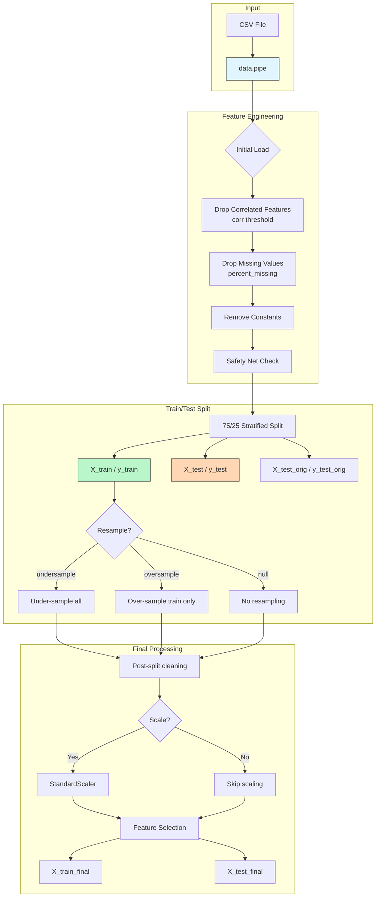
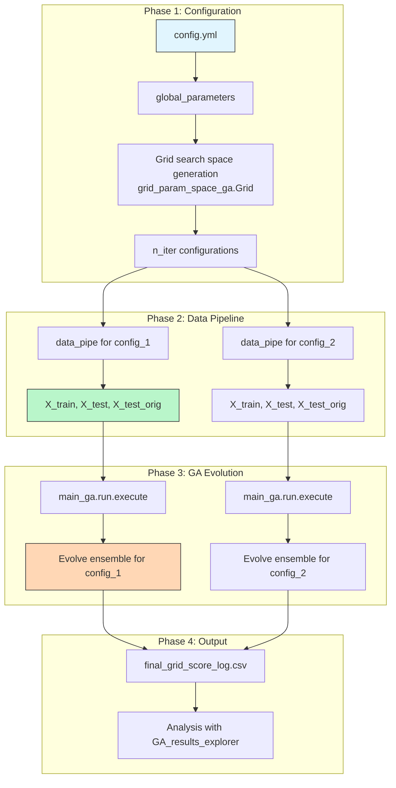
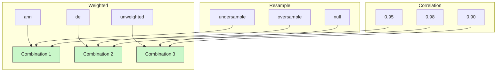

# Architectural Overview

This guide provides a high-level overview of the project's architecture, explaining the roles of its key components and how they interact. Understanding this structure will help you navigate, use, and extend the framework effectively.

---

## Pipeline Visualization

The complete experiment pipeline can be visualized in three stages:

### 1. Data Flow Pipeline (Data Preparation)



See {doc}`./Data_Workflow` for detailed data preprocessing steps.

### 2. Genetic Algorithm Evolution

```mermaid
flowchart TB
    subgraph "Initialization"
        A[Population Size N] --> B[Create Initial Individuals]
        B --> C[Evaluate Fitness (AUC)]
    end
    
    subgraph "Evolution Loop"
        C --> D[Select Top Performers<br/> Tournament Selection]
        D --> E[Crossover (cxTwoPoint)<br/> Combine Parent Features]
        E --> F[Mutation (mutFlipBit)<br/> Random Bit Flip]
        
        F --> G[Evaluate Offspring Fitness]
    end
    
    subgraph "Generation Progress"
        C --> H[Track Best Individual]
        G --> I[Record AUC per Generation]
        I --> J[Early Stopping<br/> if no improvement]
    end
    
    H --> K{Max Generations?}
    J --> L[Continue OR Stop]
    
    style B fill:#fff9c4,stroke:#333
    style C fill:#e1f5fe,stroke:#333
```

See {doc}`./GA_Python_API` for detailed genetic algorithm APIs.

### 3. Complete Experiment Flow



---

## Core Components

The project is designed with a modular architecture, separating concerns into distinct components. The main workflow revolves around the following parts:

### 1. The Orchestrator (`main.py` or `example_usage.ipynb`)

This is the main entry point for running an experiment. Its primary responsibilities are:
-   **Configuration**: Loading all experiment settings from a `config.yml` file into a central `global_params` object. This includes paths, iteration counts, and model lists.
-   **Experiment Loop**: Iterating `n_iter` times to run the genetic algorithm with different hyperparameter settings.
-   **Post-Processing**: Calling the analysis and evaluation components after the main loop is complete.

### 2. The Configuration Layer (`config.yml` and `grid_param_space_ga.py`)

This layer defines the entire hyperparameter search space. The system uses a layered approach:
-   **`config.yml`**: The primary way to set parameters. You define the search space for the GA (`ga_params`) and the grid search (`grid_params`) here.
-   **`grid_param_space_ga.py`**: This file contains the default, hardcoded search space. Any values set in `config.yml` will override these defaults.

The grid includes combinations of settings for:
-   Data preprocessing (e.g., resampling, scaling).
-   Feature selection (e.g., correlation thresholds).
-   Genetic algorithm parameters (e.g., population size, mutation rate).

#### Grid Parameter Combinations

For each `n_iter`, a unique combination is drawn from the Cartesian product:

| Parameter | Options | Effect |
|-----------|---------|--------|
| `corr` | [0.9, 0.95] | Higher = more aggressive feature removal |
| `resample` | ["undersample", "oversample", null] | Handles class imbalance |
| `scale` | [true, false] | Standardizes features for NN/SVM |

### 3. The Data Pipeline (`ml_grid.pipeline.data.pipe`)

This is a factory function that creates the central `ml_grid_object` for a single grid search iteration. It takes a specific set of hyperparameters from the configuration layer and performs initial data setup, including:
-   Loading the dataset.
-   Splitting data into training, validation, and hold-out test sets.
-   Applying initial data sampling or feature subset selection.

#### Pipeline Method Sequence

```python
data_pipe.__init__()
├── _load_data()              # Load CSV with optional sampling
├── _initial_feature_selection()  # Filter columns by name/toggles
├── _apply_safety_net()       # Retain minimal features if needed
├── _create_xy()             # Create feature/target matrices
├── _split_data()            # Train/test/validation split
├── _post_split_cleaning()   # Remove post-split constants
├── _scale_features()        # StandardScaler (optional)
└── _select_features_by_importance()  # Final feature selection
```

### 4. The `ml_grid_object`

This object is the heart of a single grid search iteration. It acts as a container that encapsulates everything needed for one full execution of the genetic algorithm:
-   Data splits (train, validation, test).
-   The specific hyperparameters for the current run, drawn from the `global_params` object.
-   Paths for saving logs, models, and results.
-   The list of base learner models to be used.

This object is passed to the core GA engine.

#### Key Attributes

| Attribute | Type | Purpose |
|-----------|------|---------|
| `X_train`, `y_train` | pd.DataFrame/Series | Training data for GA evolution |
| `X_test`, `y_test` | pd.DataFrame/Series | Evaluation data during evolution |
| `X_test_orig`, `y_test_orig` | pd.DataFrame/Series | Hold-out validation (final evaluation) |
| `model_class_list` | list | Base learner generators to use |

### 5. The Core GA Engine (`main_ga.py`)

This is where the evolutionary process happens. It receives the `ml_grid_object` and executes the genetic algorithm:
-   It uses the `modelFuncList` to create a population of diverse base learners.
-   It evolves ensembles (individuals) over multiple generations using selection, crossover, and mutation.
-   It evaluates the fitness of each ensemble using the validation data within the `ml_grid_object`.
-   It logs the results of the run to `final_grid_score_log.csv`.

#### Evolution Process

1. **Initialize**: Create population of size `pop_params[i]`
2. **Evaluate**: Calculate AUC for each individual
3. **Select**: Tournament selection (size `t_size`)
4. **Mate**: Crossover with probability `cxpb`
5. **Mutate**: Mutation with probability `mutpb`
6. **Replace**: New generation replaces old population
7. **Repeat**: Until max generations or early stopping

### 6. Model Generators (`ml_grid/model_classes_ga/`)

Each file in this directory defines a "generator" for a specific machine learning model (e.g., `XGBoost`, `LogisticRegression`). A generator is a class that knows how to:
-   Define the hyperparameter search space for its model (using `hyperopt`).
-   Instantiate its model with a given set of hyperparameters.

The GA engine uses these generators to create the base learners that form the building blocks of the ensembles. This design makes the framework highly extensible. See {doc}`../adding_new_learner`.

#### Base Learner Interface

All model generators implement:

```python
class BaseGenerator:
    def hyperparameter_search_space(self) -> Dict:
        """Returns hyperparameter search space for this model."""
        
    def generate_model(self, params: Dict):
        """Instantiates model with given hyperparameters."""
```

### 7. The Analysis Layer (`GA_results_explorer`)

After all grid search iterations are complete, this class is used to analyze the results. It reads the `final_grid_score_log.csv` file and generates a suite of plots to help you understand:
-   Which hyperparameters were most impactful.
-   Which base learners performed best.
-   The convergence behavior of the GA.

See {doc}`../interpreting_results`.

#### Analysis Outputs

| Output | Description |
|--------|-------------|
| `final_grid_score_log.csv` | All experiment results with AUC, params |
| `progress_logs/*.png` | Fitness evolution per iteration |
| `best_*.pkl` | Saved best ensembles for deployment |

### 8. The Validation Layer (`EnsembleEvaluator`)

This is the final step. The `EnsembleEvaluator` takes the best models identified during the experiment and evaluates them on the hold-out test set—data that was never seen during the entire GA process. This provides a final, unbiased measure of the models' generalization performance.

See {doc}`../evaluating_models`.

---

## Data Flow Diagrams

### Feature Transformation Log

The data pipeline tracks feature changes at each step:

```
Step                    | Before | After | Removed | Reason
------------------------|--------|-------|---------|--------------------
Initial Load            |   100  |  100  |    0    | - 
Drop Correlated         |   100  |   92  |    8    | corr > 0.95
Drop Missing            |    92  |   90  |    2    | >99% missing
Drop Constants          |    90  |   85  |    5    | Zero variance
Post-Split Clean        |    85  |   83  |    2    | Became constant after split
Final                  |        |       |         |
------------------------|--------|-------|---------|--------------------
Total dropped:         |        |       |   17    | from initial 100 features
```

### Hyperparameter Grid Visualization

The grid defines a multi-dimensional search space:



---

This modular structure allows each part of the system to be understood and modified independently, from adding a new model to changing the analysis plots.