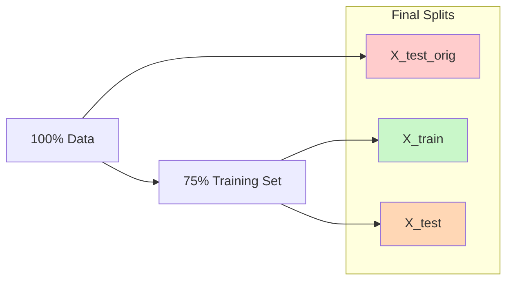
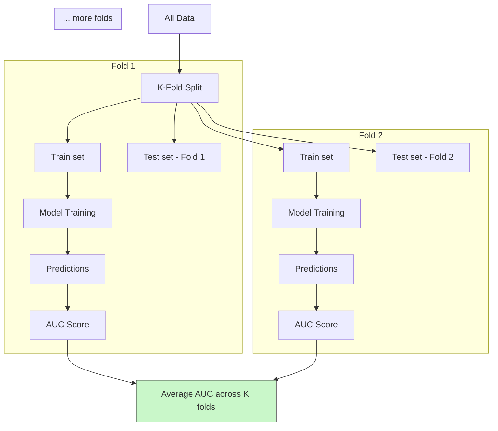
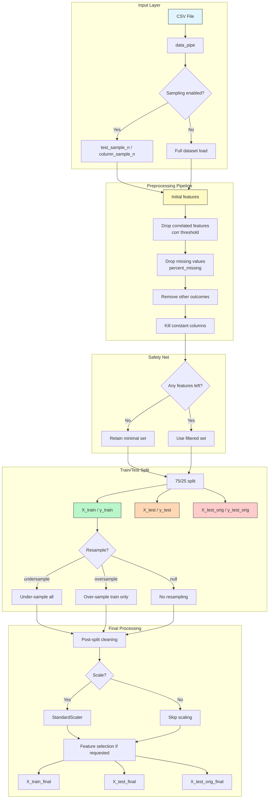

# Data Workflow

This guide explains how data flows through the ensemble genetic algorithm pipeline, from initial input to final model evaluation. It covers supported formats, preprocessing steps, train/test splitting strategies, and cross-validation workflows.

See also: {doc}`./Configuration_Guide` for hyperparameter configuration examples that impact data handling.

---

## Data Input Formats Supported

### Primary Format: CSV (Comma-Separated Values)

The framework is designed around a single primary data format:

#### Requirements

| Requirement | Details |
|------------|---------|
| **File extension** | `.csv` only |
| **Row limit** | None (optimized for large datasets) |
| **Encoding** | UTF-8 with BOM support |
| **Header row** | Required (first row must contain column names) |

#### Sample CSV Structure

```csv
patient_ID,age,male,factor_A,factor_B,disease_outcome_var_1
P001,45,1,2.3,0.8,0
P002,32,0,1.9,0.5,1
P003,67,1,3.1,1.2,0
```

### Alternative Input Methods

#### 1. Programmatic Data Loading

For in-memory data frames (Notebooks):

```python
import pandas as pd
from ml_grid.pipeline.read_in import read

# Load from DataFrame
df = pd.read_csv("data/my_data.csv")

# Or create synthetic data for testing
from ml_grid.util.synthetic_data_generator import SyntheticDataGenerator

synth_gen = SyntheticDataGenerator(n_features=10, n_samples=100)
df = synth_gen.generate_df()
```

#### 2. Sampling for Testing

Use the `test_sample_n` and `column_sample_n` parameters:

```python
# Sample 100 rows for debugging
ml_grid_object = data_pipe(
    file_name="data/large_dataset.csv",
    test_sample_n=100,
    column_sample_n=5,
    ...
)

# Sample specific columns (ensures outcome_var_1 is always included)
ml_grid_object = data_pipe(
    file_name="data/large_dataset.csv",
    column_sample_n=5,  # Includes 'age', 'male' + 3 random columns
    ...
)
```

### Data Validation

The input pipeline performs automatic validation:

| Check | Description |
|-------|-------------|
| **File existence** | Ensures CSV path is valid |
| **Numerical types** | Verifies all columns can be converted to float |
| **Outcome variable** | Checks for `outcome_var_1` suffix and binary values |
| **Missing headers** | Validates column names are present |

---

## Preprocessing Steps

The data pipeline automatically executes a sequence of preprocessing steps. These can be configured via the `grid_params` section in `config.yml`.

### Step 1: Initial Feature Selection

Filters columns based on configuration:

```python
# Configuration in config.yml
grid_params:
  # Include/exclude features based on column names containing these words
  feature_toggles: {
    "include": ["factor", "biochemical"],
    "exclude": ["ID", "date"]
  }
```

### Step 2: Correlation Filtering

Removes highly correlated features to reduce multicollinearity.

#### How It Works

1. Computes Pearson correlation matrix for all features
2. Iteratively removes one feature from each high-correlation pair (> threshold)
3. Keeps the feature with lower variance (more stable)

#### Configuration

```yaml
grid_params:
  corr: [0.95, 0.98]              # Correlation thresholds to test
```

| Threshold | Use Case |
|-----------|----------|
| `0.90` | Very strict - keeps most features but risks multicollinearity |
| `0.95` | Standard balance for most datasets |
| `0.98` | Aggressive - removes redundant features, fewer columns |

#### Visualization Method

After preprocessing, use:

```python
from ml_grid.pipeline.data_correlation_matrix import handle_correlation_matrix

corr_drops = handle_correlation_matrix(
    local_param_dict={"corr": 0.95},
    drop_list=[],
    df=original_df
)

print(f"Dropped due to correlation: {corr_drops}")
```

### Step 3: Missing Value Handling

Columns with excessive missing data are removed.

#### Configuration

```yaml
grid_params:
  percent_missing: [100, 99, 95]  # Thresholds for column removal
```

| Threshold | Behavior |
|-----------|----------|
| `100` | Remove columns with >100% missing (all columns) - effectively disables filtering |
| `99.8` | Remove columns with >99.8% missing values (allows rare NaNs) |
| `95` | Aggressive - removes even moderately missing columns |

#### Imputation Strategy

Remaining missing values are handled internally:
- **Numerical features**: Mean imputation via `sklearn.SimpleImputer(strategy="mean")`
- **Base learners**: Many algorithms (XGBoost, etc.) handle NaN natively

### Step 4: Constant Column Removal

Features with zero variance across all samples are removed.

#### Why This Matters

Constant columns provide no predictive signal and waste computational resources.

```python
# Example of constant column detection
import pandas as pd

df_with_constant = pd.DataFrame({
    "feature1": [1, 2, 3, 4],     # Variable
    "feature2": [5, 5, 5, 5],     # Constant - will be dropped
    "outcome_var_1": [0, 1, 0, 1]
})

# After constant removal:
df_clean = df_with_constant.drop(columns=["feature2"])
```

### Step 5: Feature Scaling

Standardizes features to zero mean and unit variance (Optional).

#### Configuration

```yaml
grid_params:
  scale: [true, false]            # Whether to apply StandardScaler
```

#### When to Use Scaling

| Scenario | Recommended |
|----------|-------------|
| Neural Networks | `scale: true` |
| SVMs | `scale: true` |
| Distance-based methods (KNN) | `scale: true` |
| Tree-based models (RF, XGBoost) | `scale: false` (not required) |

### Step 6: Feature Importance Selection

Selects top features based on importance scores.

#### Configuration

```yaml
grid_params:
  n_features: [50, 100, "all"]    # Number of features to retain
```

#### Available Methods

The framework supports multiple importance scoring methods:

| Method | Base Model | When to Use |
|--------|-----------|-------------|
| `RandomForest` | Random Forest | General-purpose, robust |
| `XGBoost` | Gradient Boosting | High-performance scenarios |
| `LogisticRegression` | Logistic Regression | Linear relationships |

#### Feature Selection Process

1. Train temporary model on all features
2. Extract importance scores
3. Rank features by importance
4. Select top `n_features`

---

## Train/Test Split Options

The framework implements a **stratified hold-out validation** strategy with three splits.

### Standard Stratified Split



#### Data Split Naming Convention

| Split | Purpose | Usage |
|-------|---------|-------|
| `X_train`, `y_train` | Training new models | During GA evolution |
| `X_test`, `y_test` | Evaluation during GA | Fitness calculation |
| `X_test_orig`, `y_test_orig` | Final validation | Unseen data evaluation |

#### Split Statistics

For a 1,000-sample dataset:
- **Training**: ~563 samples (used for GA training)
- **Testing**: ~188 samples (for GA fitness evaluation)
- **Validation** (`_orig`): ~250 samples (final hold-out)

### Resampling Strategies

Controlled via `resample` parameter: `null`, `"undersample"`, `"oversample"`

#### 1. No Resampling (`null`)

Standard stratified split with class distribution preserved:

```python
X_train, X_test, y_train, y_test = train_test_split(
    X, y, test_size=0.25, random_state=1, stratify=y
)
```

**Use Cases**: Balanced datasets, no class imbalance issues

#### 2. Undersampling (`"undersample"`)

Reduces majority class before splitting:

```python
from imblearn.under_sampling import RandomUnderSampler

rus = RandomUnderSampler(random_state=0)
X_resampled, y_resampled = rus.fit_resample(X, y)

# Then perform stratified split
```

**Use Cases**: Severe class imbalance (e.g., 1% positive class)

#### 3. Oversampling (`"oversample"`)

Adds synthetic minority samples (SMOTE) after train/test split:

```python
from imblearn.over_sampling import RandomOverSampler

# Split first to prevent data leakage
X_train_orig, X_test_orig, y_train_orig, y_test_orig = train_test_split(
    X, y, test_size=0.25, random_state=1
)

# Oversample ONLY the training set
ros = RandomOverSampler(random_state=1)
X_train_orig, y_train_orig = ros.fit_resample(X_train_orig, y_train_orig)
```

**Use Cases**: Moderate imbalance, want to preserve all original data

---

## Cross-Validation Workflows

While the main GA uses a single hold-out validation set for efficiency, cross-validation can be integrated for final model evaluation.

### Standard CV Strategy (For Final Evaluation)

After finding the best ensemble via GA, evaluate using 10-fold CV:

```python
from sklearn.model_selection import RepeatedKFold, cross_validate

cv = RepeatedKFold(n_splits=10, n_repeats=3, random_state=1)

scores = cross_validate(
    best_ensemble_model,
    X_train,
    y_train,
    cv=cv,
    scoring=['roc_auc', 'accuracy', 'precision', 'recall'],
    n_jobs=-1
)
```

### Genetic Algorithm-Specific CV Integration

The GA fitness function can incorporate CVscores for more robust evaluation:

| Approach | Description | Trade-offs |
|----------|-------------|------------|
| **Single split** (default) | Use hold-out validation for speed | Faster but noisier estimate |
| **K-fold CV in fitness** | Average K splits per individual | More accurate but 10x slower |
| **3-折 CV only for best N** | Use CV only on top candidates | Balance of accuracy/speed |

### Parameter Grid Cross-Validation

After GA finds optimal base learners, fine-tune hyperparameters via GridSearchCV:

```python
from sklearn.model_selection import GridSearchCV
from ml_grid.pipeline.grid_search_cross_validate import grid_search_crossvalidate

# Extract best ensemble configuration
best_params = {
    "n_estimators": [50, 100, 200],
    "max_depth": [5, 10, 15]
}

grid_search = GridSearchCV(
    estimator=XGBoost(),
    param_grid=best_params,
    cv=5,
    scoring='roc_auc'
)

grid_search.fit(X_train, y_train)
```

### Cross-Validation Visualization



---

## Data Pipeline Diagrams

### Complete Data Flow



### Feature Transformation Log

The pipeline maintains a detailed log of feature changes:

| Step | Features Before | Features After | Removed | Reason |
|------|----------------|----------------|---------|--------|
| Initial Load | 100 | 100 | 0 | Base count |
| Drop Correlated | 100 | 92 | 8 | corr > 0.95 |
| Drop Missing | 92 | 90 | 2 | >99% missing |
| Drop Other Outcomes | 90 | 90 | 0 | Not present |
| Drop Constants | 90 | 85 | 5 | Zero variance |
| Split | 85 | 85 | 0 | No feature removal |
| Post-Split Clean | 85 | 83 | 2 | Became constant after split |
| Final Features | - | **83** | **17** | Total |

---

## Summary

This data workflow guide covered:
1. **Input formats**: CSV requirements and alternative loading methods
2. **Preprocessing steps**: Correlation filtering, missing value handling, scaling
3. **Train/test splits**: Stratified hold-out with 3-way split options
4. **Resampling strategies**: Undersample/oversample configuration
5. **Cross-validation workflows**: Integration for final evaluation

The data pipeline is designed to be fully automated and configurable via `config.yml`, making it easy to adapt to different dataset characteristics while maintaining reproducibility through random state management.

See {doc}`./Implementation_Guide` for complete implementation walkthrough with setup, execution examples, and result interpretation.
