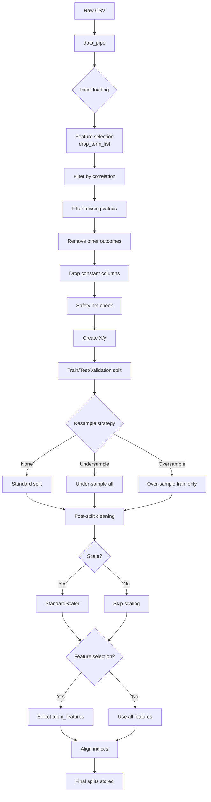

# Implementation Guide

This guide provides a step-by-step walkthrough for running an ensemble genetic algorithm experiment on your dataset. It covers installation, setup, data preparation, execution with different configurations, and result interpretation.

See also: {doc}`./Data_Workflow` for detailed data preprocessing workflows.

---

## Prerequisites

- **Python >=3.12** (required)
- Virtual environment management (e.g., `venv`, `conda`)
- Access to a machine with sufficient compute resources (CPU/GPU)

For complete architecture overview, see {doc}`./Architectural_Overview`.

### Installation

The project can be installed in two ways:

#### Method 1: Manual Installation (Recommended for Customization)

```bash
# Clone the repository
git clone <repository-url>
cd ensemble_genetic_algorithm

# Create and activate virtual environment
python -m venv ga_env
source ga_env/bin/activate  # Linux/Mac
# or
ga_env\Scripts\activate     # Windows

# Install dependencies
pip install -r requirements.txt
```

#### Method 2: Automated Setup Script

```bash
chmod +x setup.sh && ./setup.sh
```

This script automatically:
- Creates a `ga_env` virtual environment
- Installs all required packages
- Configures the environment

### Dependencies

The core dependencies include:

| Package | Version | Purpose |
|---------|---------|---------|
| `scikit-learn` | >=1.3 | Data preprocessing, model validation |
| `numpy` | >=1.24 | Numerical computations |
| `pandas` | >=2.0 | Data manipulation |
| `DEAP` | Latest | Genetic algorithm framework |
| `imblearn` | Latest | Resampling techniques (SMOTE, etc.) |
| `sklearn` | Latest | Machine learning models |

---

## Step-by-Step Setup and Configuration

### 1. Prepare Your Dataset

Ensure your dataset meets the following requirements:

#### File Format
- CSV format with headers
- All values must be numeric (integers or floats)
- No strings, categories, or object types

#### Outcome Variable Requirements
- Must be binary (e.g., `0` and `1`)
- Column name **must** end with `_outcome_var_1`
  - ✅ Valid: `disease_outcome_var_1`, `readmission_outcome_var_1`
  - ❌ Invalid: `outcome`, `target`

#### Example CSV Structure

```csv
feature_A,feature_B,age,male,disease_outcome_var_1
0.5,2.3,45,1,0
0.8,1.9,32,0,1
0.3,3.1,67,1,0
```

### 2. Configure Your Experiment

Create a `config.yml` file in the project root directory:

```yaml
global_params:
  input_csv_path: "data/my_dataset.csv"      # Path to your CSV
  n_iter: 20                                  # Number of grid iterations
  model_list: [
    "logisticRegression", 
    "randomForest", 
    "XGBoost",
    "gradientBoosting"
  ]                                            # Base learners to use
  verbose: 2                                  # Logging level (1-5)
  base_project_dir: "experiments/"            # Output directory
  testing: false                              # Set true for quick tests

ga_params:
  nb_params: [8, 16]                          # Number of base learners per ensemble
  pop_params: [50]                            # Population size
  g_params: [100]                             # Number of generations

grid_params:
  weighted: ["unweighted"]                    # Weighting method
  resample: ["undersample", "oversample", null]  # Sampling strategy
  corr: [0.95]                                # Correlation threshold for feature removal
  percent_missing: [100]                      # Max % missing values allowed
  scale: [true, false]                        # Whether to standardize features
```

#### Key Configuration Parameters

| Parameter | Type | Description |
|-----------|------|-------------|
| `input_csv_path` | str | Path to your dataset |
| `n_iter` | int | Number of grid search iterations (higher = more thorough but slower) |
| `model_list` | list | List of model class names to include in base learner pool |
| `verbose` | int | Logging level: 1=info, 2=debug, 3=pathological debug |
| `base_project_dir` | str | Directory for saving experiment results |
| `nb_params` | list[int] | List of possible numbers of base learners per ensemble |
| `pop_params` | list[int] | Population sizes for the GA |
| `g_params` | list[int] | Number of generations to evolve |

### 3. Run the Experiment

Create a Python script (e.g., `run_experiment.py`) or use Jupyter Notebook:

```python
from tqdm import tqdm
from ml_grid.util.global_params import global_parameters
from ml_grid.util.grid_param_space_ga import Grid
from ml_grid.pipeline.data import pipe as data_pipe
from ml_grid.pipeline.main_ga import run as ga_run

# Load configuration and initialize global parameters
global_params = global_parameters(config_path='config.yml')

# Create grid of hyperparameter combinations
grid = Grid(global_params=global_params)

# Iterate through parameter space
for i in tqdm(range(global_params.n_iter)):
    local_param_dict = next(grid.settings_list_iterator)
    
    # Execute data pipeline for this configuration
    ml_grid_object = data_pipe(
        global_params=global_params,
        file_name=global_params.input_csv_path,
        drop_term_list=[],  # Terms to drop from feature selection (optional)
        local_param_dict=local_param_dict,
        base_project_dir=global_params.base_project_dir,
        param_space_index=i,
    )
    
    # Run the genetic algorithm
    ga_run(
        ml_grid_object=ml_grid_object,
        local_param_dict=local_param_dict,
        global_params=global_params
    ).execute()
```

---

## Data Preparation Workflow

The data pipeline performs automatic preprocessing with configurable steps:

### Pipeline Steps

1. **Data Loading**
   - Reads CSV file (supports sampling for debugging)
   - Validates dataset structure and outcome variable format

2. **Initial Feature Selection**
   - Filters columns based on configured feature toggles
   - Identifies target outcome variable (`outcome_var_1`)

3. **Feature Filtering**
   - Removes highly correlated features (configurable via `corr`)
   - Removes columns with excessive missing data (configurable via `percent_missing`)
   - Removes other outcome variables that aren't the target

4. **Safety Net Activation**
   - If all features are pruned, retains a minimum set for model training
   - Prevents pipeline failure due to overly aggressive filtering

5. **Data Splitting**
   - 75% → Train (further split into train/validation)
   - 25% → Hold-out validation (`_orig` sets)

6. **Post-Split Cleaning**
   - Removes constant columns that arise from splitting
   - Handles data leakage prevention

7. **Feature Scaling** (optional)
   - Standardizes features if `scale=true`
   - Applies same scaler to train/test/validation sets

8. **Feature Importance Selection** (optional)
   - Selects top `n_features` based on importance scoring
   - Uses multiple methods: Random Forest, XGBoost, etc.

### Data Split Strategies

The pipeline supports three resampling strategies via the `resample` parameter:

| Strategy | Description | When to Use |
|----------|-------------|-------------|
| `null` / `None` | Standard stratified split | Balanced datasets |
| `"undersample"` | Randomly removes majority class samples | Severe class imbalance |
| `"oversample"` | Adds synthetic minority class samples (SMOTE) | Moderate class imbalance |

### Visualizing the Data Pipeline



---

## Running GA with Different Configurations

### Configuration 1: Quick Test Run (Debug Mode)

```yaml
global_params:
  testing: true                              # Activate quick test mode
  verbose: 3                                 # High verbosity for debugging

grid_params:
  corr: [0.95]
  resample: [null]
```

This configuration:
- Uses smaller grid sizes
- Reduces population and generation counts
- Increases logging for troubleshooting

### Configuration 2: Performance Optimization Run

```yaml
global_params:
  n_iter: 5
  verbose: 1

grid_params:
  corr: [0.95, 0.98]                         # More aggressive correlation removal
  resample: [null]                           # No resampling for speed
  scale: [true]                              # Standardize features
```

### Configuration 3: Thorough Hyperparameter Search

```yaml
global_params:
  n_iter: 50                                 # Increase iterations
  verbose: 2

ga_params:
  nb_params: [8, 16, 32]                     # Larger ensemble sizes
  pop_params: [100, 200]                     # Larger population
  g_params: [200, 300]                       # More generations

grid_params:
  resample: [null, "undersample", "oversample"]
  corr: [0.90, 0.95]                         # Multiple thresholds
```

### Configuration 4: Medical Dataset (High Missingness)

```yaml
global_params:
  verbose: 2

grid_params:
  percent_missing: [99]                      # Allow high missingness
  resample: ["undersample"]                  # Handle class imbalance
  corr: [0.95]
```

### Configuration 5: High-Dimensional Genomic Data

```yaml
global_params:
  verbose: 2

grid_params:
  scale: [true]                              # Essential for genomic data
  n_features: [100, 500, "all"]             # Feature importance selection
  corr: [0.98]                               # Less aggressive filtering
  
ga_params:
  pop_params: [100]                          # Larger population for feature diversity
  g_params: [200]
```

---

## Interpreting Results and Evaluating Models

### Output Files Structure

After running, your `base_project_dir` will contain:

```
experiments/
├── final_grid_score_log.csv                 # Main results file
├── progress_logs/                           # Per-iteration logs
│   └── *_progress.png                       # Fitness evolution plots
└── best_pop=*_g=*_nb=*.pkl                 # Saved best ensembles
```

### Interpreting `final_grid_score_log.csv`

This CSV contains all experiment results. Key columns:

| Column | Description |
|--------|-------------|
| `method_name` | The base learner algorithm name |
| `PG` | Parameter grid size evaluated |
| `AUC` | Area Under the ROC Curve (validation set) |
| `AUC_train` | AUC on training set (to detect overfitting) |
| `Best params` | Best hyperparameters found |
| `Run time` | Execution time in minutes |
| `Feature importance score` | Random Forest-based feature ranking |

#### Example Result Row

```csv
method_name,AUC,ACC,Best params,n_features
randomForest,0.87,0.82,"{'max_depth': 15}",50
XGBoost,0.89,0.84,"{'learning_rate': 0.1}",30
```

### Evaluating Model Performance

#### 1. Check for Overfitting

Compare training vs validation AUC:
- **Good**: Training AUC ≈ Validation AUC
- **Overfitting**: Training AUC >> Validation AUC
- **Underfitting**: Both scores are low

#### 2. Compare Across Configurations

Use the `param_space_index` column to identify which grid search iteration each row represents.

```python
import pandas as pd

# Load results
results = pd.read_csv("experiments/final_grid_score_log.csv")

# Find best performing configuration
best_config = results.loc[results['AUC'].idxmax()]

print(f"Best AUC: {best_config['AUC']}")
print(f"Algorithm: {best_config['method_name']}")
print(f"Parameters: {best_config['Best params']}")
```

#### 3. Analyze Final Ensemble (from Best Run)

Use the `GA_results_explorer` class to deep-dive into top-performing ensembles:

```python
from ml_grid.util.GA_results_explorer import GA_results_explorer

explorer = GA_results_explorer(
    base_project_dir="experiments/",
    config_path='config.yml'
)

# Get all results sorted by AUC
results_df = explorer.get_sorted_results()

# Create visualizations
explorer.plot_result_distributions()
explorer.plot_auc_distribution()
explorer.plot_best_models_per_param_space()
```

### Visual Interpretation

#### Fitness Evolution Plot

Each experiment generates a `progress_logs/*_progress.png` file showing:

**X-axis**: Generation number  
**Y-axis**: Population best fitness (AUC score)  

*Interpretation*:
- **Steep initial rise + plateau** = Good convergence
- **Plateau early** = May need more generations or larger population
- **Oscillating** = Possible overfitting or noisy evaluation

#### AUC Distribution Plot

Shows performance distribution across all grid search iterations.

### Advanced: Manual Ensemble Evaluation

To evaluate the best ensemble on a hold-out test set:

```python
import pickle
from ml_grid.util.evaluate_ensemble_methods import evaluate_ensemble_methods

# Load best ensemble from previous run
with open("experiments/best_pop=50_g=100_nb=8.pkl", "rb") as f:
    best_ensemble = pickle.load(f)

# Evaluate on hold-out data
evaluator = evaluate_ensemble_methods(best_ensemble)

auc_train = evaluator.evaluate_auc(X_train, y_train)
auc_test = evaluator.evaluate_auc(X_test_orig, y_test_orig)

print(f"Training AUC: {auc_train}")
print(f"Hold-out Test AUC: {auc_test}")
```

---

## Best Practices

### 1. Start Small
Begin with:
- `n_iter=5`
- `pop_params=[20]`, `g_params=[50]`
- Single model in `model_list`
- One `resample` strategy

Once confident in the setup, scale up.

### 2. Monitor Resource Usage
Large populations and generations consume significant RAM:

| Population Size | Generations | Estimated RAM |
|----------------|-------------|---------------|
| 50 | 100 | ~2 GB |
| 100 | 200 | ~8 GB |
| 200 | 300 | ~24 GB |

Use `n_iter` to control total iterations.

### 3. Validate Data First
Run a quick sanity check on your data:

```python
import pandas as pd

df = pd.read_csv("data/my_dataset.csv")
print(f"Shape: {df.shape}")
print(f"Missing values:\n{df.isnull().sum()}")
print(f"Data types:\n{df.dtypes}")
```

### 4. Use `testing=True` for Development
This reduces all grid sizes and speeds up iterative development.

---

## Troubleshooting

### Common Errors

#### "No features available to select for safety net"
- **Cause**: Too many features have been dropped during filtering
- **Solution**: Relax correlation threshold (`corr`) or missing percentage (`percent_missing`)

#### "AUC undefined (only one class in y_true)"
- **Cause**: Test set contains only one class
- **Solution**: Increase train/test split size (currently 75%/25%) or use `oversample`

#### MemoryError during execution
- **Cause**: Too-large population or generation count
- **Solution**: Reduce `pop_params` and `g_params`

---

## Summary

This implementation guide covered:
1. Installation methods for Python >=3.12+
2. Data preparation requirements (CSV format, binary outcome)
3. Step-by-step configuration via `config.yml`
4. Running experiments with multiple preset configurations
5. Interpreting results from `final_grid_score_log.csv`
6. Visualizing fitness evolution and ensemble performance

All experiment outputs are logged to the `base_project_dir` directory for post-analysis using the `GA_results_explorer`.
